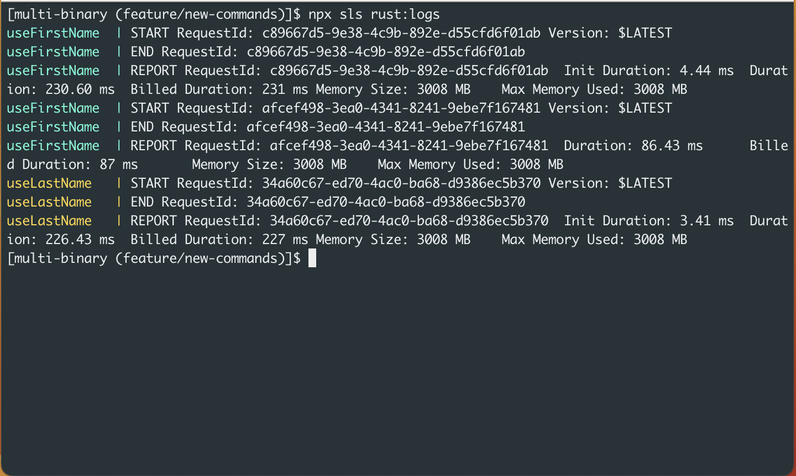
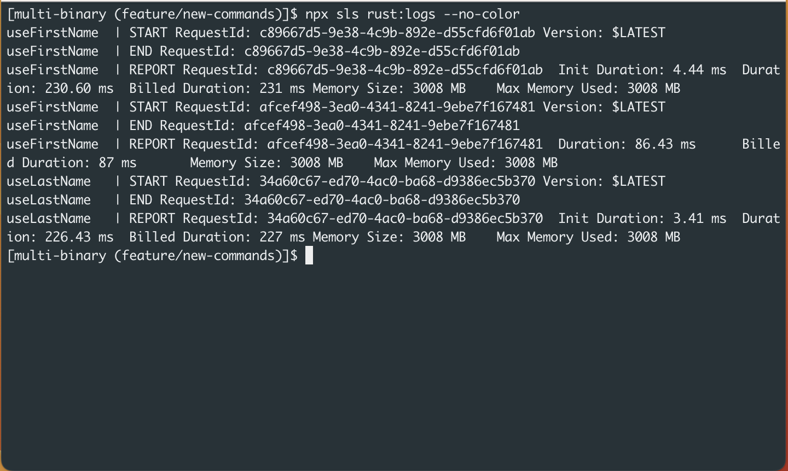

# serverless-rust-plugin rust:logs command

Show logs from the container. This command emits logs to stderr.

## Usage

```
$ serverless rust:logs ( -f func0 -f func1 ... -w --all --no-color)
```

### example

```
$ serverless rust:logs
rustFunc1  | START RequestId: 67394de9-1577-4ebd-be58-ba4237b71ef1 Version: $LATEST
rustFunc1  | END RequestId: 67394de9-1577-4ebd-be58-ba4237b71ef1
rustFunc1  | REPORT RequestId: 67394de9-1577-4ebd-be58-ba4237b71ef1	Init Duration: 4.09 ms	Duration: 237.96 ms	Billed Duration: 238 ms	Memory Size: 3008 MB	Max Memory Used: 3008 MB
rustFunc0  | START RequestId: e85bd375-77cf-411a-b31b-08170a454a62 Version: $LATEST
rustFunc0  | END RequestId: e85bd375-77cf-411a-b31b-08170a454a62
rustFunc0  | REPORT RequestId: e85bd375-77cf-411a-b31b-08170a454a62	Init Duration: 4.28 ms	Duration: 240.70 ms	Billed Duration: 241 ms	Memory Size: 3008 MB	Max Memory Used: 3008 MB
rustFunc0  | START RequestId: 0a3e927b-8ff2-456a-9691-5003b7e1004e Version: $LATEST
rustFunc0  | END RequestId: 0a3e927b-8ff2-456a-9691-5003b7e1004e
rustFunc0  | REPORT RequestId: 0a3e927b-8ff2-456a-9691-5003b7e1004e	Duration: 40.65 ms	Billed Duration: 41 ms	Memory Size: 3008 MB	Max Memory Used: 3008 MB
```

## Options

| option | shortcut | type | required | default| description |
| :--- | :---: | :---: | :---: | :---: | :--- |
| function | f | string |  |  | The name of the function to show logs. |
| watch | w | boolean |  | false | Keep streaming logs until the SIGINT signal is emitted.(Ctrl + C) |
| no-color |  | boolean |  | false | By default this command show logs with ansi color. Using this flag you can off this feature. |
| all |  | boolean |  | false | By default this commands streams logs from stdout of the container but using this flag, you can also get logs from stderr of the container. |

### --no-color option

#### without --no-color option (default)



#### with --no-color option



### --all option

#### without --all option (default)

```
$ serverless rust:logs
useLastName   | START RequestId: 34a60c67-ed70-4ac0-ba68-d9386ec5b370 Version: $LATEST
useLastName   | END RequestId: 34a60c67-ed70-4ac0-ba68-d9386ec5b370
useLastName   | REPORT RequestId: 34a60c67-ed70-4ac0-ba68-d9386ec5b370	Init Duration: 3.41 ms	Duration: 226.43 ms	Billed Duration: 227 ms	Memory Size: 3008 MB	Max Memory Used: 3008 MB
useFirstName  | START RequestId: c89667d5-9e38-4c9b-892e-d55cfd6f01ab Version: $LATEST
useFirstName  | END RequestId: c89667d5-9e38-4c9b-892e-d55cfd6f01ab
useFirstName  | REPORT RequestId: c89667d5-9e38-4c9b-892e-d55cfd6f01ab	Init Duration: 4.44 ms	Duration: 230.60 ms	Billed Duration: 231 ms	Memory Size: 3008 MB	Max Memory Used: 3008 MB
useFirstName  | START RequestId: afcef498-3ea0-4341-8241-9ebe7f167481 Version: $LATEST
useFirstName  | END RequestId: afcef498-3ea0-4341-8241-9ebe7f167481
useFirstName  | REPORT RequestId: afcef498-3ea0-4341-8241-9ebe7f167481	Duration: 86.43 ms	Billed Duration: 87 ms	Memory Size: 3008 MB	Max Memory Used: 3008 MB
```

#### with --all option

You can see some additional logs compared to the above output. (without --all option)

```
$ npx sls rust:logs --all
useFirstName  | 01 Dec 2022 16:05:30,251 [INFO] (rapid) exec '/var/runtime/bootstrap' (cwd=/var/task, handler=)
useFirstName  | 01 Dec 2022 16:05:39,357 [INFO] (rapid) extensionsDisabledByLayer(/opt/disable-extensions-jwigqn8j) -> stat /opt/disable-extensions-jwigqn8j: no such file or directory
useFirstName  | 01 Dec 2022 16:05:39,363 [WARNING] (rapid) Cannot list external agents error=open /opt/extensions: no such file or directory
useFirstName  | START RequestId: c89667d5-9e38-4c9b-892e-d55cfd6f01ab Version: $LATEST
useFirstName  | END RequestId: c89667d5-9e38-4c9b-892e-d55cfd6f01ab
useFirstName  | REPORT RequestId: c89667d5-9e38-4c9b-892e-d55cfd6f01ab	Init Duration: 4.44 ms	Duration: 230.60 ms	Billed Duration: 231 ms	Memory Size: 3008 MB	Max Memory Used: 3008 MB
useFirstName  | START RequestId: afcef498-3ea0-4341-8241-9ebe7f167481 Version: $LATEST
useFirstName  | END RequestId: afcef498-3ea0-4341-8241-9ebe7f167481
useFirstName  | REPORT RequestId: afcef498-3ea0-4341-8241-9ebe7f167481	Duration: 86.43 ms	Billed Duration: 87 ms	Memory Size: 3008 MB	Max Memory Used: 3008 MB
useLastName   | 01 Dec 2022 16:05:30,258 [INFO] (rapid) exec '/var/runtime/bootstrap' (cwd=/var/task, handler=)
useLastName   | 01 Dec 2022 16:05:47,311 [INFO] (rapid) extensionsDisabledByLayer(/opt/disable-extensions-jwigqn8j) -> stat /opt/disable-extensions-jwigqn8j: no such file or directory
useLastName   | 01 Dec 2022 16:05:47,317 [WARNING] (rapid) Cannot list external agents error=open /opt/extensions: no such file or directory
useLastName   | START RequestId: 34a60c67-ed70-4ac0-ba68-d9386ec5b370 Version: $LATEST
useLastName   | END RequestId: 34a60c67-ed70-4ac0-ba68-d9386ec5b370
useLastName   | REPORT RequestId: 34a60c67-ed70-4ac0-ba68-d9386ec5b370	Init Duration: 3.41 ms	Duration: 226.43 ms	Billed Duration: 227 ms	Memory Size: 3008 MB	Max Memory Used: 3008 MB
```
